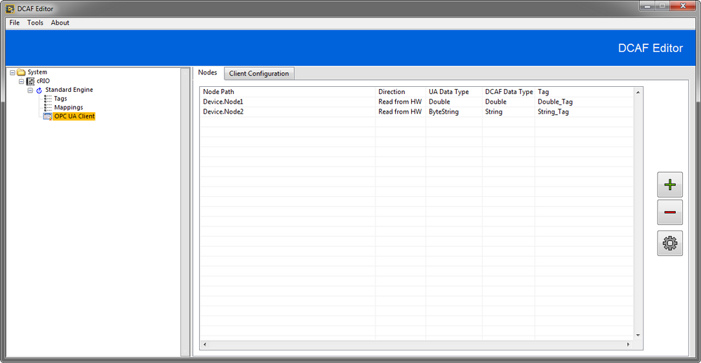
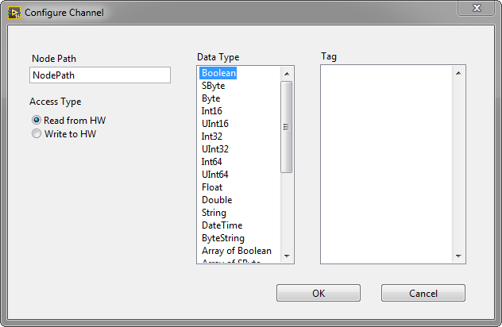
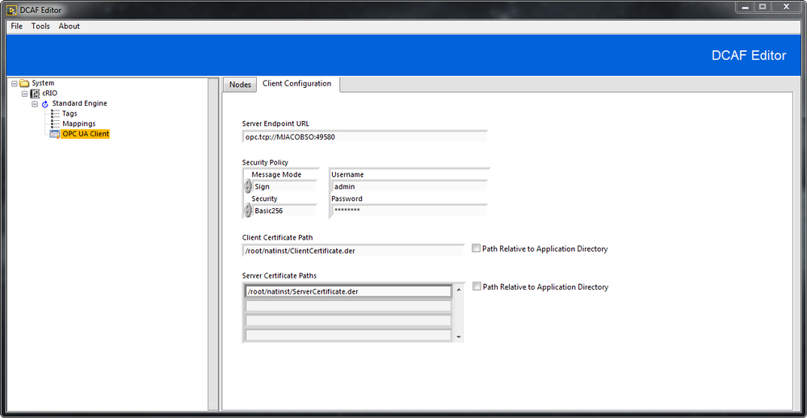

# Overview

Connect your DCAF application to an OPC UA Server

# Description
OPC UA is a platform independent, machine to machine communication protocol for industrial automation developed by the OPC Foundation. See [Why OPC UA Matters](http://www.ni.com/white-paper/13843/en/) for more information on the OPC UA Protocol.

This module acts as an OPC UA client, allowing read and write access to tags hosted on an OPC UA server.

# Configuration of the OPC UA Client Module
### Channel Configuration
The first tab in the editor will be used to configure your channels and map them to tags within the DCAF engine. 

Use the ‘+’ button to add new channels, the ‘-‘ button to remove the highlighted channel, and the gear button to edit the highlighted channel.

When adding or editing a channel, the following screen will be presented.

**Node Path**: The node path consists of node names separated by a period between each name, with the parent node name before the period and child node name after the period. For example, a node path *Device.folder.item* indicates that *Device* is the parent node of *folder*, and *folder* is the parent node of *item*. The following examples demonstrate how to handle some unique conditions:

+ If a node name contains a period, use a pair of quotation marks around the node name. For example, if a node name is *Device.1*, and this node contains a child node *folder*, the node path of the child node is *“Device.1”.folder*.
+ If a node name contains one or more quotation marks, add one quotation mark beside each quotation mark and then a pair of quotation marks around the node name. For example, if a node name is *Device1”Device2*, and this node contains a child node *folder*, the node path of the child node is *“Device1””Device2”.folder*.
+ If a node name contains both a period and quotation mark, both of the previous rules still apply. For example, if a node name is *Device1”Device2.Device3*, and this node contains a child node *folder*, the node path of the child node is *“Device1””Device2.Device3”.folder*.

**Access Type**: Whether this channel will be read from or written to the OPC UA Server.

**Data Type**: This is the data type of the item on the OPC UA Server. Not all OPC UA data types are directly supported by the DCAF engine. The module supports reading and writing these items to an OPC UA Server but will convert the data to the appropriate type when communicating with the DCAF engine. For example, a node of type DateTime will be stored as a Double and the Tag list will be populated by all available Double tags. The table below shows OPC UA data types and what will be used in the DCAF engine for those data types which do not have a 1-to-1 mapping:

OPC UA Data Type | DCAF Data Type
--- | ---
ByteString | String
DateTime | Double
DateTime Array | Array of Double

**Tag**: The DCAF tag to map this channel to.

### Client Configuration
The Client Configuration tab will be used to configure the information necessary to open a connection to the OPC UA Server.

**Server Endpoint URL**: Specifies the endpoint URL to which the OPC UA client connects. The endpoint URL consists of the hostname and the port of the OPC UA server. The format of the server endpoint URL is *opc.tcp://hostname:︎port*. The hostname is the IP address or computer name.

**Security Policy**: The security options required to connect to the specified server.

**Certificate Paths**: The path to the public key file. The file extension of the file must be .der. The public key and private key (.pfx) must have the same name and reside in the same folder.

**Path Relative to Application Directory**: If left unchecked, the certificate paths are interpreted as absolute paths. If checked, the certificate paths will be interpreted as being relative to the application directory as defined by the [LabVIEW file constant](http://zone.ni.com/reference/en-XX/help/371361L-01/glang/application_directory/).

# Software Requirements
+ LabVIEW 2014+
+ Datalogging and Supervisory Control Module if using LabVIEW 2016 or lower
+ OPC UA Toolkit if using LabVIEW 2017+

# Limitations
The module does not give users the option to read or write to a bytestring array node on an OPC UA server as the functionality is not supported by the underlying OPC UA API (CAR 308742).
